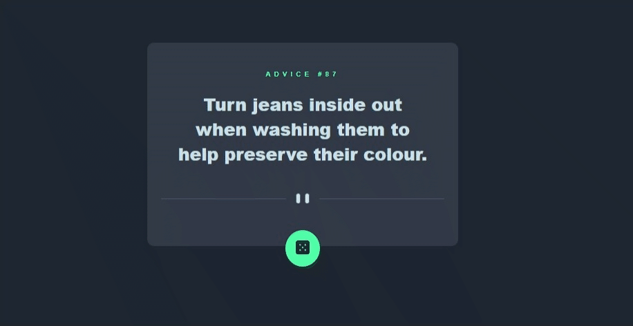

# Advice generator app React

Projeto realizado para prática de conceitos com objetivo acadêmico, projeto retirado do site Frontend Mentor.

[Frontend Mentor](https://www.frontendmentor.io)

O objetivo foi construir em Typescript e React um Portfólio.

<a href="https://project-advice-generator-app-typescript-eor13.vercel.app/" target="_blank">Clique Aqui para ir direto para página</a>

## Tecnologias utilizadas
- Typescript
- React
- Styled Component
- Vercel

### Conceitos Aplicados de cada Tecnologia
<ol>
    <li>Typescript
        <ul>
            <li>Utilização de Tipagem Explicita </li>
            <li>Utilização de Inferência de tipos</li>
            <li>Utilização de Tipagem em funções</li>
            <li>Utilização do módulos ( import e export ) </li>
        </ul>
    </li>
    <li>React
        <ul>
            <li>Utilização de componentes de Função</li>
            <li>Utilização de Elementos de Função</li>
            <li>Utilização de Eventos de "Click"</li>
            <li>Utilização de Arrow functions como padrão para estabelecer Funções</li>
            <li>Utilização de Components Stateless e StateFull</li>
            <li>Utilização de Hooks como useState e useEffect</li>
            <li>Renderização de Condicionais</li>
            <li>Atribuição via Desestruturação de Itens</li>
        </ul>
    </li>
    <li>CSS
        <ul>
            <li>Utilização de <strong style="color:green;">Styled Components através do React</strong> para estilização das páginas</li>
        </ul>
    </li>
    <li>Libs e Ferramentas
        <ul>
            <li>Vercel - Utilização de plataforma para exibição página nos navegadores.</li>
        </ul>
    </li>
</ol>